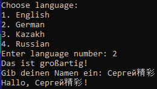

# DialogBlocksConsoleAppML
Пример мультиязычной консольной программы на C++ с использованием wxWidgets и DialogBlocks для Visual Studio 2022



```
#include <wx/wx.h>

#ifdef _WIN32 // Если это Windows
#include <io.h>
#include <fcntl.h>
#endif 

int main(int argc, char** argv) {
	wxApp myApp; // Создать объект wxApp-приложения
	wxInitializer initializer(argc, argv); // Инициализировать приложение
	if (!initializer.IsOk()) { // Если инициализация не удалась
		wxPuts(wxT("Failed to initialize the application!")); // Вывести сообщение
		return -1; // Завершить программу с кодом -1
	}
	wxLocale m_locale; // Создать объект локализации приложения для подсистемы wxWidgets
	setlocale(LC_ALL, "ru_RU.UTF-8"); // Установить локаль по умолчанию для Linux

	// Список языков
	std::vector<std::string> languages = { "English", "German", "Kazakh", "Russian" };

	wxPuts(wxT("Choose language:")); // Вывести сообщение
	for (int i = 0; i < languages.size(); ++i) { // Перебрать все языки
		// Вывести номер языка и название языка
		wxPuts(std::to_wstring(i + 1) + L". " + wxString::FromUTF8(languages[i].c_str()));
	}

	wchar_t languageNumber; // Создать переменную для номера языка
	wxPrintf(wxT("Enter language number: ")); // Вывести сообщение
	std::wcin.get(languageNumber); // Считать номер языка
	std::wcin.ignore(65535 * sizeof(wchar_t), '\n'); // Очистить буфер ввода

	if (languageNumber == '1') { // Если выбран английский язык
		m_locale.Init(wxLANGUAGE_ENGLISH); // Инициализировать локализацию
	}
	else if (languageNumber == '2') { // Если выбран немецкий язык
		m_locale.Init(wxLANGUAGE_GERMAN); // Инициализировать локализацию
	}
	else if (languageNumber == '3') { // Если выбран казахский язык
		m_locale.Init(wxLANGUAGE_KAZAKH); // Инициализировать локализацию
	}
	else if (languageNumber == '4') { // Если выбран русский язык
		m_locale.Init(wxLANGUAGE_RUSSIAN); // Инициализировать локализацию
	}
	else { // Если выбран неправильный номер
		m_locale.Init(wxLANGUAGE_RUSSIAN); // Инициализировать локализацию
		wxPuts(wxT("Wrong number!")); // Вывести сообщение
	}

	m_locale.AddCatalogLookupPathPrefix(wxT("locale")); // Добавить путь к каталогу локализации
	m_locale.AddCatalog(wxT("en")); // Добавить каталог локализации английского языка
	m_locale.AddCatalog(wxT("kk")); // Добавить каталог локализации казахского языка
	m_locale.AddCatalog(wxT("de")); // Добавить каталог локализации немецкого языка

#ifdef __WXMSW__ // Определение для Windows
	_setmode(_fileno(stdout), _O_U16TEXT); // Установить Юникод для вывода в консоли Windows
	_setmode(_fileno(stdin), _O_U16TEXT); // Установить Юникод для ввода в консоли Windows
	_setmode(_fileno(stderr), _O_U16TEXT); // Установить Юникод для вывода ошибок в консоли Windows
#endif

	wxPuts(wxGetTranslation(L"Замечательно! Das ist großartig! Wonderful! 精彩的！ رائع!"));
	wxPrintf(wxGetTranslation(L"Введите имя: "));
	std::wstring fio; // Создать строковую переменную
	std::wcin >> fio; // Считать строку
	wxPuts(wxGetTranslation(L"Привет") + ", " + fio + "!"); // Вывести строку

#ifdef __WXMSW__ // Определение для Windows
	system("pause"); // Приостановить выполнение программы
#else // Определение для Linux
	system("read -p \"Нажмите Enter для продолжения...\"  var"); // Приостановить выполнение программы
#endif

	myApp.Exit(); // Завершить главный цикл приложения
}
```

## Ссылки:

http://www.anthemion.co.uk/dialogblocks/

https://www.wxwidgets.org/

https://visualstudio.microsoft.com/ru/vs/community/

https://poedit.net/
